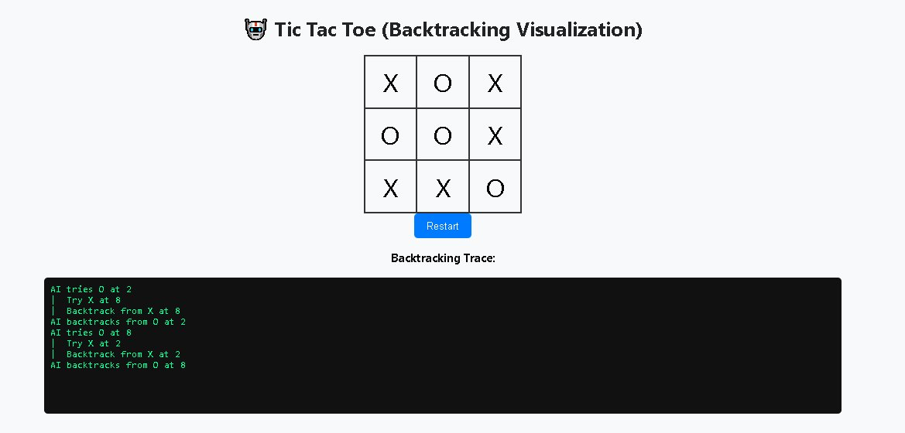

# Tic Tac Toe — Backtracking Visualization

> An interactive Tic Tac Toe game where the AI thinks out loud — every move and backtrack is shown in real time.

**Live Demo → [tictactoeusingbacktrackingdsa.vercel.app](https://tictactoeusingbacktrackingdsa.vercel.app/)**

---

## Screenshot



---

## What This Project Does

This is not just a Tic Tac Toe game. It is a **visual demonstration of the Minimax algorithm with backtracking**, a classic technique in tree-search AI and a core topic in Data Structures & Algorithms.

When you play as **X**, the AI responds as **O** by exploring every possible future game state recursively, assigning scores, and backtracking to choose the optimal move. The full decision trace — every position the AI considered and every position it abandoned — is printed live on screen after each AI move.

---

## How the Algorithm Works

### Minimax

Minimax is a decision-making algorithm used in two-player zero-sum games. The AI assumes:

- **O (AI)** always tries to **maximise** its score
- **X (Human)** always tries to **minimise** the AI's score

Terminal state scores:
```
O wins  →  +10
X wins  →  -10
Draw    →   0
```

The AI picks the move that leads to the highest score under the assumption that the human always plays optimally.

### Backtracking

After the AI explores a branch of the game tree, it **undoes** the move (sets the cell back to `None`) before trying the next option. This is backtracking — the board is mutated and then restored, never duplicated.

```python
board[i] = "O"                          # place move
score, trace = minimax(board, False)    # recurse
board[i] = None                         # backtrack ← key step
```

### Trace Output

Every placement and every backtrack is appended to a trace list and returned to the frontend:

```
AI tries O at 4
|  Try X at 0
|  |  Try O at 1
|  |  Backtrack from O at 1
|  Backtrack from X at 0
AI backtracks from O at 4
```

The indentation depth shows how deep in the game tree the AI was searching at each step.

---

## Tech Stack

| Layer | Choice |
|---|---|
| Backend | Python · Flask |
| Frontend | Vanilla HTML / CSS / JavaScript |
| Algorithm | Minimax with Backtracking |
| API | `POST /move` — receives board state, returns best move + trace |
| Deployment | Vercel |

---

## Project Structure

```
/
├── app.py                          # Flask server — Minimax logic and /move endpoint
├── index.html                      # Game UI — board rendering and trace display
└── screenshots/
    └── screenshot-gameplay.png     # Gameplay screenshot used in README
```

---

## API Reference

### `POST /move`

**Request body**
```json
{
  "board": ["X", null, "O", null, "X", null, null, null, null]
}
```

**Response**
```json
{
  "move": 8,
  "trace": [
    "AI tries O at 0",
    "|  Try X at 1",
    "|  Backtrack from X at 1",
    "AI backtracks from O at 0",
    "..."
  ]
}
```

`move` is the 0-indexed cell the AI has chosen. `trace` is the full backtracking log.

---

## Running Locally

```bash
git clone https://github.com/Prathamesh8989/tictactoe-backtracking
cd tictactoe-backtracking
pip install flask
python app.py
```

Open [http://localhost:5000](http://localhost:5000).

---

## Key Code — Minimax with Backtracking

```python
def minimax(board, is_max, depth=0, trace=None):
    """
    Recursive Minimax with backtracking trace.

    At each step the function:
    1. Checks for a terminal state (win / draw).
    2. Iterates over every empty cell.
    3. Places the current player's symbol.
    4. Recurses into the resulting state.
    5. Removes the symbol (backtrack) before trying the next cell.

    Args:
        board   (list): 9-element board, each cell is "X", "O", or None.
        is_max  (bool): True when it is the AI's (O) turn.
        depth   (int):  Current recursion depth, used for trace indentation.
        trace   (list): Accumulated log of moves and backtracks.

    Returns:
        tuple: (best_score, trace)
    """
    result = check_winner(board)
    if result == "O":    return 10, trace
    if result == "X":    return -10, trace
    if result == "Draw": return 0, trace

    if is_max:
        best = -float("inf")
        for i in range(9):
            if board[i] is None:
                board[i] = "O"
                trace.append(f"{'|  ' * depth}Try O at {i}")
                score, trace = minimax(board, False, depth + 1, trace)
                board[i] = None                                   # backtrack
                trace.append(f"{'|  ' * depth}Backtrack from O at {i}")
                best = max(best, score)
        return best, trace
    else:
        best = float("inf")
        for i in range(9):
            if board[i] is None:
                board[i] = "X"
                trace.append(f"{'|  ' * depth}Try X at {i}")
                score, trace = minimax(board, True, depth + 1, trace)
                board[i] = None                                   # backtrack
                trace.append(f"{'|  ' * depth}Backtrack from X at {i}")
                best = min(best, score)
        return best, trace
```

---

## Why This Matters (DSA Context)

| Concept | Where It Appears |
|---|---|
| Recursion | `minimax` calls itself for every empty cell |
| Backtracking | `board[i] = None` after each recursive call |
| Game Tree Search | Full exploration of all reachable board states |
| Pruning opportunity | Alpha-Beta pruning can be added to skip branches |
| Time complexity | O(9!) worst case — reduces significantly mid-game |

The AI is unbeatable. Every game either ends in a draw (if you play perfectly) or a loss for the human. This is a provable property of Minimax on a fully explored game tree.

---

## License

MIT
